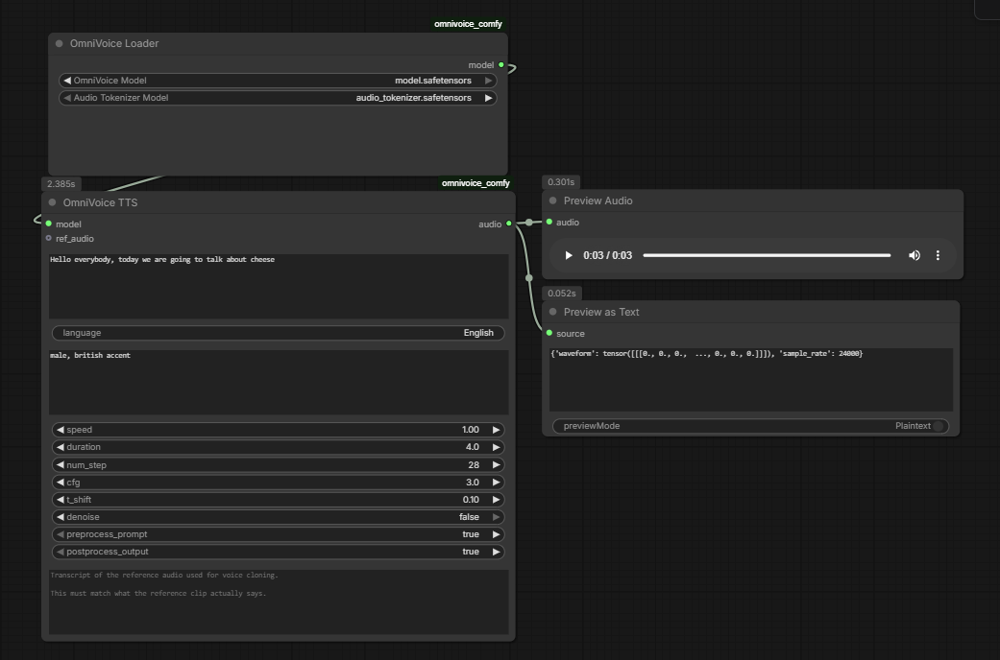

# OmniVoice ComfyUI Node




ComfyUI custom node for OmniVoice TTS and voice cloning.

Upstream project:
- https://github.com/k2-fsa/OmniVoice

Download Model Here:
- https://huggingface.co/k2-fsa/OmniVoice

## Warning

### ⚠️ WARNING HF TRANSFORMER 5.3 and ABOVE REQUIRED. ⚠️

Check what your ComfyUI environment is using:

```bash
pip list | grep transformer
```

Why: some models and libraries might still heavily depend on 4.5X HF Transformers.

## Install

Direct manual clone:

1. `git clone https://github.com/komikndr/omnivoice_comfy` inside `ComfyUI/custom_nodes`
2. `cd omnivoice_comfy`
3. `pip install -r requirements.txt`

ComfyUI manager:
1. `comfy node install omnivoice_comfy`


4. Put the OmniVoice weights in `ComfyUI/models/tts/omnivoice/`.

Expected layout:

```text
ComfyUI/
  models/
    tts/
      omnivoice/
        model.safetensors
        audio_tokenizer.safetensors
```

You only need to place the two `.safetensors` files in the folder above. The node already includes the required tokenizer and config assets.

## Nodes

### OmniVoice Loader

Loads:
- `OmniVoice Model`
- `Audio Tokenizer Model`

The loader builds a local runtime snapshot from the embedded config assets and the two selected weight files.

### OmniVoice TTS

Inputs:
- `text` for the target speech
- optional `instruct`
- optional `ref_audio` and `ref_text` for voice cloning

If you use `ref_audio`, you must also provide `ref_text`.

## Notes

- Whisper auto-transcription is disabled. Voice cloning requires `ref_text`.
- If you want voice cloning, install `https://github.com/yuvraj108c/ComfyUI-Whisper` or another similar workflow/pipeline that auto-transcribes the source audio. OmniVoice requires the transcript of the source audio. You can manually transcribe a 3 second clip, but that gets tedious in batch processing.
- The node uses files from `ComfyUI/models/tts/omnivoice/` and builds a symlinked runtime snapshot.
- If symlink creation fails on your system, use a full HuggingFace-style OmniVoice folder instead.

## LLM Disclaimer
- This repo is build with the help of Qwen 3.5 9B and embeddinggemma-300m to store the original code into vector store
for fast retrieval (most of my time in coding wasted on code repo search)
